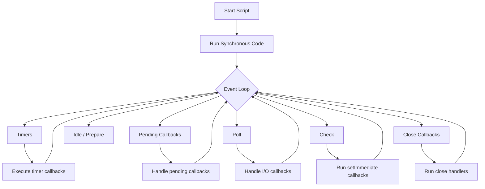

# Event Loop in Node.js

This note explains the basic flow of the Node.js event loop and how it affects the examples in this folder.

## Simple event loop diagram

## In simple words

Node.js executes synchronous code first. After that, it uses the event loop to process asynchronous work such as:

- timers like `setTimeout`
- file I/O like `fs.readFile`
- promises and microtasks
- `setImmediate`

## Order of execution

A typical order is:

1. `process.nextTick()` callbacks
2. Promise microtasks
3. Timers
4. `setImmediate`
5. I/O callbacks

This is why the output order in the example files may look different from what you expect at first.
